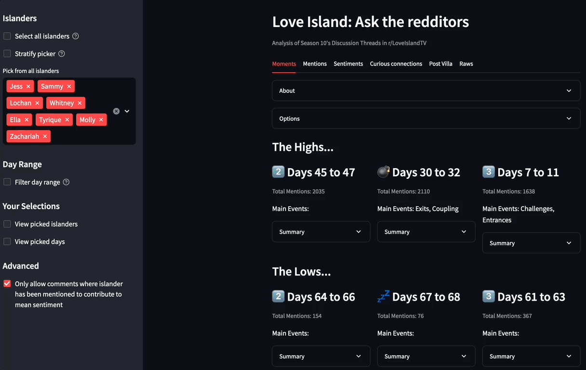
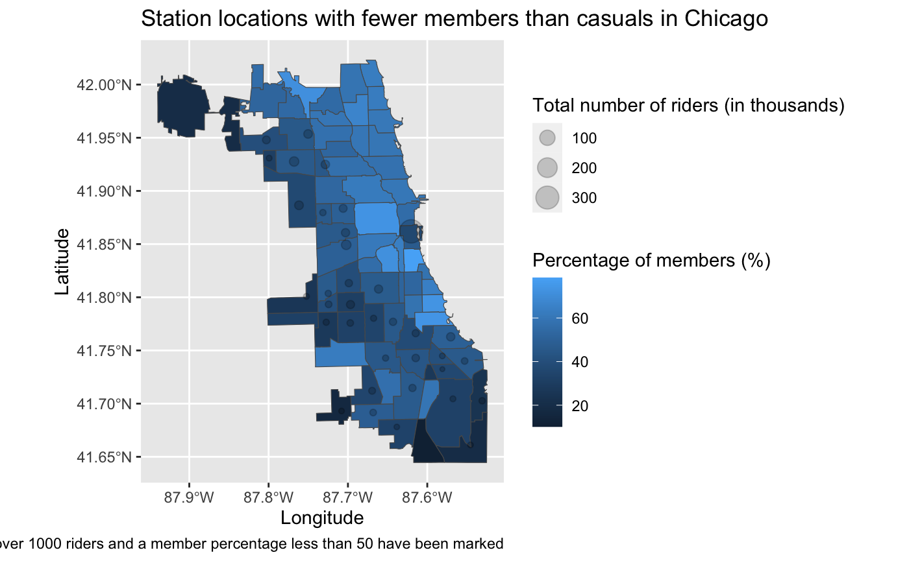

# Project Portfolio
Below are a collection of some of the Data-based projects i've contributed to.

## Love Island Season 10
[https://github.com/kimathinyota/LoveIslandDashboardS10](https://github.com/kimathinyota/LoveIslandDashboardS10)

Created a dashboard to explore the changing popularity of S10 Love Island contestants on the r/LoveIslandTV subreddit throughout the show's runtime. [Click to view Dashboard](https://loveislands10.streamlit.app/)

### Solution
Comments and post data and metadata were collected daily after each episode and stored in a database. Python was used to analyse for each contestant their mentions, associations, sentiments and relevance over and during the season. 

### Skills developed/Technology Stack
* Python (pandas) for general data wrangling
* Python (altair) for developing interactive charts
* Python (streamlit) for developing an interactive dashboard
* Python (networkx) for analysing and displaying co-mention graphs   

## Cyclistics Data Analysis
[https://github.com/kimathinyota/CyclisticAnalysis](https://github.com/kimathinyota/CyclisticAnalysis) 

As a capstone project to earn the Google Data Analytics Certificate, I created a report in R analysing the data (and detailing my approach) for a given (fictional) company.

### Solution
Using generated data for a fictional bike-share company, Cyclistics, to: investigate the differences between members and casual riders in their usage of Cyclistic bikes to better understand how to convert casual riders into members.

For example: The graphic is taken from the final report and highlights the areas with fewer members than casuals that the company can target 

[See full report here](https://htmlpreview.github.io/?https://github.com/kimathinyota/CyclisticAnalysis/blob/main/CyclisticsFindings.html ) 

### Skills developed/Technology Stack
* Python (pandas) to merge multiple CSV files into a single large one
* R (tidyverse) for general data wrangling
* R (ggplot2) for all visualisations
* R (geosphere; sf) for map visualisations

## Recommender System
[https://github.com/kimathinyota/RecommenderSystem](https://github.com/kimathinyota/RecommenderSystem)

I worked in a pair to create an Item Based Collaborative Filtering Recommender System.

### Solution
Given a large data set of user ratings on item, our system was developed to predict the ratings of users on items they haven't yet rated.
Our system took several parameters, and we developed an experiment to find the optimal parameter configuration for our recommender system.

### Skills developed/Technology Stack
* SQL and MySQL database for faster processing of given CSV data files
* Code written in Java

## Simulating the Social Exchange Theory
[https://github.com/kimathinyota/social-group-simulator](https://github.com/kimathinyota/social-group-simulator) 

* This project involves simulating people, as intelligent agents, interacting
with each other in a social environment and finding emergent social phenomena. 
* This
environment will take the form of a game, where the agents can use their skills to compete
for gold and their decisions will be influenced by their assigned personality and skill level.
* These agents are given the options to mentor, steal from, help and befriend another agent, and this decision will be influenced by the agent’s personality and skill level.
* An experiment was designed for the purpose of finding combination of agents that corresponds with greater social phenomena.

### Solution
Below shows the simulation running for 12 agents in a limited-resource environment

### Technology Stack
* Python graphics.py module for displaying the simulation
* Python Threading module allowing each Agent to occupy a seperate thread from each other and their environment.
* Python networkx for constructing graphs/networks of Agent interactions and for calculating point centrality
* Python numpy to represent Q-matrix for the purpose of applying reinforcement learning to agents
* Python (scipy) for data processing
* Python (matplotlib) for data visualisation
* MySQL database and SQL for storing and processing experimental data

