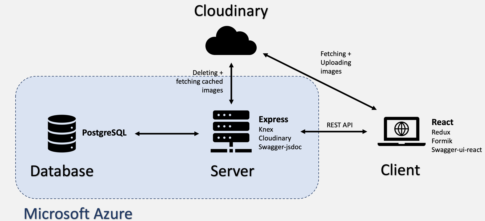

# Project Portfolio

## Platform for Health Tech

I worked in a team of six developers to develop a system for our client in the IFLS  (Institute for Life Sciences) of the University of Southampton.

Our client wanted a system that can matchmake Clinicians with Technologists, who both work in different domains and so had problems understanding each other. Previously, they used to run workshops that allowed for inter-departmental colloboration, but the Covid pandemic exposed the need for a scalable, online solution. 

Our final solution was inspired by social media networks like Facebook but tailored towards medical and technical professionals.

### Solution
* A web app for virtual networking and problem resolution, that should be intuitive and easy to use.
* The system allows users to create posts, through which they can describe a problem, ask for help, or simply share an idea or project they are currently working on.
* It matchmakes Clinicians and Technologists by recommending relevant posts to them.
* Users can interact with each other - so we included liking and commenting features.

### Technology Stack
* **Front End:** React framework, with libraries such as Redux and Formik for state management and form validation, respectively.
* **Back End:** Express framework, with libraries such as Knex and Cloudinary for query building and image storage, respectively.
* We created a REST API for communication between the client and the server.
* For the database, we used PostgreSQL as it is feature-rich and our group has experience with it.
* We hosted our application on Microsoft Azure using a University-provided subscription.

## Simulating the Social Exchange Theory
Link to repo: 

## NoteBankFX: Note-Taking Software

## Programming Language and Compiler

## Evolutionary Algorithms

## Recommender System 

